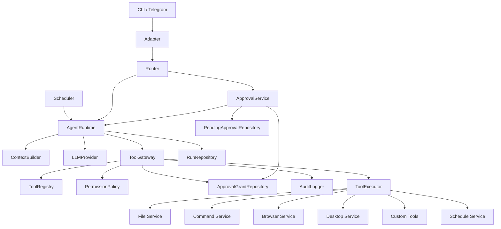

# Architecture

`my-agents` is a small, trusted local personal agent. Its owner develops and
uses it directly on one real Ubuntu machine, managed as a systemd user service.
It is not public, multi-tenant, containerized, virtualized, or an OS sandbox.

The agent may use the browser, desktop automation, filesystem, shell commands,
and owner-written custom tools to complete real work. The safety model is
**application-level safety guardrails**: reduce accidental harm and refuse
clearly destructive actions. It is not a secure isolation boundary if the agent
process or a trusted custom tool is compromised.

## Design Principles

```text
ALLOW BY DEFAULT
REQUIRE APPROVAL WHEN NECESSARY
DENY CLEARLY DESTRUCTIVE ACTIONS
```

The system favors useful autonomous work: research, browsing, desktop actions,
file edits, code/config changes, schedules, custom tools, and arbitrary
commands are ordinary capabilities. It does not use a fixed command allowlist
or permanently fixed filesystem roots as its primary permission mechanism.

```ts
type PermissionDecision =
  | { kind: 'allow' }
  | { kind: 'require_approval'; reason: string }
  | { kind: 'deny'; reason: string }
```

## System Shape



The directory layout should reflect these boundaries rather than make the
provider, adapter, or individual tool an authority boundary:

```text
agent/src/
  adapters/       CLI and owner-only Telegram transport
  runtime/        AgentRuntime, run lifecycle, cancellation and limits
  brain/          Gemini/OpenAI request-response and tool-call conversion
  context/        instructions, memory, skills, history and token budget
  tools/          ToolGateway, registry, executor and tool contracts
  security/       PermissionPolicy and ApprovalService
  services/       files, commands, browser, desktop and schedules
  scheduler/      cron polling, leases and scheduled run requests
  storage/        SQLite migrations and repositories
  workflows/      optional high-level state machines only
  logging/        audit, redaction and retention support
```

## Execution Model

`AgentRuntime` is the sole orchestrator. It creates and persists a run, loads
context, calls an LLM provider, records LLM/tool steps, continues the tool loop,
and completes, fails, pauses, resumes, cancels, or times out the run. A former
`AgentToolLoop` belongs in `runtime/`; it is not itself a tool.

Every tool action follows one path. No adapter, provider, scheduler, workflow,
skill, or service may bypass it.

```text
LLM Tool Call
    -> parse and validate input
    -> resolve ToolDefinition
    -> build ExecutionContext
    -> PermissionPolicy evaluates intent, approvals, executable/arguments,
       target, cwd, scope, impact, and recoverability
    -> allow: ToolExecutor executes
    -> require_approval: persist PendingApproval and pause run
    -> deny: return denied ToolResult
```

`PermissionPolicy` always runs **before** `ToolExecutor`. Direct executor
execution is rejected unless `ToolGateway` has authorized the call; the
executor never makes its own permission decision.

### Module Responsibilities

| Module | Responsibility |
| --- | --- |
| `brain/` | Provider integration only: request/response conversion, structured output and tool-call parsing, normalized provider errors. It neither executes tools nor owns policy/workflows. |
| `context/` | Loads system instructions, memory and skill metadata; selects/compacts history and manages token budget. Web, files, Telegram, tool output, custom-tool output, and screenshots are untrusted content, never system instructions. |
| `ToolGateway` | Only execution entry point: resolves and validates a tool, builds metadata, evaluates policy and approvals, writes audit events, executes allowed actions, or creates pending approval. |
| `PermissionPolicy` | Pure decision service: destructive detection, contextual impact, user-intent and approval matching. It has no subprocess, browser, desktop, or other side effects. |
| `ToolExecutor` | Invokes services only after gateway `allow`; supports timeout and cancellation. |
| `ApprovalService` | Persists pending decisions, accepts owner approval/rejection, grants/revokes/expires scope, and resumes a paused run. |
| `workflows/` | Optional high-level state machines. They use `AgentRuntime` and `ToolGateway`; they do not call providers, subprocesses, or browser backends directly. |

## Permission Policy

Evaluate actions in this order:

1. Clearly destructive action: deny.
2. Exact current user request: allow unless destructive.
3. Existing approval covers the current objective: allow.
4. Routine, reasonably scoped, recoverable action: allow.
5. Significant system impact, data-loss risk, sensitive-data access, or new external effect: require approval.
6. Otherwise: allow and audit.

Routine actions include web research and navigation, browser/desktop clicks and
typing, screenshots, ordinary file reads and source/config edits, creating
files/directories, custom tools, tests/lint/build/format/typecheck,
non-destructive Git/status commands, small side effects, project dependencies,
and creating, editing, deleting, or running schedules. Do not prompt merely
because a command starts a process, writes a file, a tool edits code, or a task
has many steps.

Approval is for valid but significant actions: important `/etc` changes,
system-wide package changes, out-of-scope `sudo`, important service
stop/restart, user-data deletion, broad overwrites, `git reset --hard`,
`git clean`, force push, risky database migrations, sending/publishing/
submitting/uploading, account/permission changes, financial effects, broad
unreviewed scripts, and unrelated credentials or private data. One approval
covers equivalent steps in the same objective; ask again only for materially
broader scope, higher risk, new data-loss risk, or a new external effect.

A clear owner request is approval for that exact task in the current run. For
example, a request to install and configure Nginx includes installing packages,
editing its configuration, validation, enable/restart, and status checks.
Likewise, an exact requested message may be sent to its specified recipient,
but not expanded to other recipients or public publication.

Hard-deny patterns include filesystem-root or broad-home deletion, disk/partition
formatting, block-device writes, bootloader damage, fork bombs, unbounded
deletion without a target, actions that make the machine unbootable or
inaccessible, destructive payloads, secret exfiltration, and uninspected
`curl | sh` / `wget | bash` equivalents. Decisions inspect executable,
arguments, shell syntax, cwd, targets, scope, request, approval, and
recoverability—not only an executable name. Thus `rm /tmp/agent-output.txt`
may be allowed while `rm -rf /`, `rm -rf /*`, and `rm -rf /home` are denied.

## Runs and Approvals

Every execution is a persisted run, sufficient for restart recovery, audit,
debugging, cancellation, schedule tracking, and approval pause/resume.

```ts
type RunStatus =
  | 'queued'
  | 'running'
  | 'waiting_approval'
  | 'completed'
  | 'failed'
  | 'cancelled'
```

A run records its IDs (`runId`, `sessionId`, `traceId`), principal/channel,
request, status, LLM steps, tool calls/results, active and pending approvals,
errors, and lifecycle timestamps.

```ts
interface ApprovalGrant {
  id: string
  principalId: string
  description: string
  scope: 'run' | 'session' | 'schedule' | 'persistent'
  runId?: string
  sessionId?: string
  scheduleId?: string
  approvedRiskCategories?: string[]
  resourceHints?: string[]
  commandHints?: string[]
  createdAt: Date
  expiresAt?: Date
  revokedAt?: Date
}
```

Matching is contextual, not exact-argument replay: same goal, action family,
resource/system area, scope, and risk level. Schedule grants cover the approved
recurring behavior without prompts on every run.

Approval UX is intentionally simple. Telegram shows **Approve** and **Reject**
buttons with a short scope statement such as “Cho phép cài và cấu hình Nginx
trong run này.” CLI accepts \`approve <short-id>\` / \`reject <short-id>\` (or an
interactive yes/no choice). The short ID identifies the pending request; users
never enter a security digest. Internally, a pending approval remains bound to
\`pendingActionId\`, run, owner/chat, expiry, and an action digest. A changed
action invalidates the old request and creates a new one, preventing stale or
replayed approval.

## Services and Integrations

### Commands and Files

Commands may be arbitrary when non-destructive and in scope, or approved when
necessary. Prefer `executable` plus `args`, but support `shellCommand` for
pipelines, redirection, globs, conditionals, and multi-step scripts.

```ts
interface CommandRequest {
  executable?: string
  args?: string[]
  shellCommand?: string
  cwd: string
  env?: Record<string, string>
  timeoutMs: number
  maxOutputBytes: number
}
```

The command service validates cwd, caps/redacts stdout/stderr, times out and
kills the process group, records command/cwd/exit code/duration, avoids passing
the full secret environment, and never supplies a password on a command line.
`sudo` is not categorically blocked: a clear system-install/configuration
request may cover it, but out-of-scope `sudo` needs approval and a destructive
payload is denied.

Default roots (workspace, agent data, artifacts, temp) make routine work easy;
they are not permanent fences. File service resolves absolute normalized paths,
handles symlinks rather than `startsWith`, distinguishes write/delete, uses
atomic writes, backs up important configs where appropriate, audits access, and
limits unclear bulk operations. Ordinary reads outside defaults are allowed when
relevant; unrelated credentials, private keys, password stores, or sensitive
data require approval.

### Browser, Desktop, and Custom Tools

Managed browser and CDP are supported; CDP has broad access to the owner's
personal browser session. Browser/desktop automation may open apps and URLs,
search/read/click/scroll/type/fill forms, and switch windows without approval
per click. Exact requested external effects are allowed; new effects, major
impact/financial actions, or destructive actions respectively require approval
or are denied.

Owner-authored registered custom tools are trusted integrations and do not need
a sandbox or approval merely for being custom. Each defines name, description,
input schema, optional default risk, and an execution function:

```ts
interface ToolDefinition {
  name: string
  description: string
  inputSchema: unknown
  defaultRisk?: 'routine' | 'sensitive' | 'destructive'
  execute(input: unknown, context: ExecutionContext, signal: AbortSignal): Promise<unknown>
}
```

Custom tools are registered programmatically in source. Each tool lives in its
own module and `src/tools/register-tools.ts` imports and registers the known
set explicitly:

```ts
registerTool(backlogTool)
registerTool(browserTool)
registerTool(myCustomTool)
```

The registry does not scan directories, dynamically import modules, or load
drop-in plugins. This keeps TypeScript validation, duplicate-name failures,
debugging, and lifecycle ownership simple while the tool set is small. A
future plugin/autoload mechanism is a separate change if owner-installed tools
grow beyond source-managed registration.

It still enters through `ToolGateway` for audit, timeout,
cancellation, contextual approval, and destructive detection; side-effecting
backends cannot be bypassed.

### Telegram and Scheduler

Telegram is an owner-only personal bot: allowlist owner user ID and chat IDs,
ignore other users, accept approvals only from the owner and bind them to the
pending run, deduplicate update IDs, apply basic rate limiting, and load global
memory only for the configured owner.

Static schedules in `config.json` are source of truth and have stable IDs.
Startup refreshes every config-owned schedule (including enabled, delivery,
cron and timezone) and disables config entries removed from the file. Runtime
created schedules use `source: 'runtime'`; config seeding never overwrites
them. Scheduler semantics are at-least-once and side-effecting jobs should be
idempotent where practical.

```ts
interface Schedule {
  id: string
  source: 'config' | 'runtime'
  cron: string
  timezone: string
  enabled: boolean
  lastStartedAt?: Date
  lastCompletedAt?: Date
  lastResultDigest?: string
  leaseOwner?: string
  leaseExpiresAt?: Date
}
```

The scheduler never invokes a subprocess itself:

```text
Scheduler -> ScheduledRunRequest -> AgentRuntime -> ToolGateway
          -> PermissionPolicy -> ToolExecutor
```

It only pauses for new out-of-scope behavior, materially broader impact, new
data-loss risk, unapproved external effect, or destructive action.

## Operations and Data Handling

Use SQLite migrations, WAL mode, and a busy timeout. Support graceful shutdown,
per-session concurrency locks, `AbortSignal` cancellation, maximum tool steps,
per-run deadlines, provider timeouts/retries, command timeouts, artifact/log
retention, and correlation IDs (`traceId`, `sessionId`, `runId`,
`toolCallId`).

Raw AI logs can contain prompts, file/browser content, cookies, tokens, command
output, and credentials. Being untracked by Git is insufficient protection.
Use appropriate file permissions, secret redaction, configurable raw logging
and retention, and never log plaintext passwords, tokens, cookies, or
Authorization headers.

## Architecture Invariants

1. The agent is a trusted local operator on a real machine, protected by application-level guardrails rather than an OS sandbox.
2. Most actions allow by default; only significant impact needs approval and clearly destructive actions are denied.
3. A clear user request approves its exact current task; approvals cover a task, run, session, or schedule and equivalent follow-on steps.
4. Policy evaluates executable, arguments, target, cwd, impact, and intent—not a command name or hard allowlist alone.
5. The agent may access/edit system files, run commands, install software, and change system configuration when the task calls for it.
6. Every tool action crosses `ToolGateway`; `PermissionPolicy` precedes `ToolExecutor`, with no bypass by adapters, providers, schedulers, workflows, or skills.
7. Browser and desktop actions do not prompt per interaction; approved schedules do not prompt per execution.
8. Every run is auditable, pausable, resumable, and cancellable.
9. Web, files, Telegram, and tool output are untrusted content, not instructions.
10. Guardrails prevent evident machine destruction without removing the flexibility required of a personal agent.
