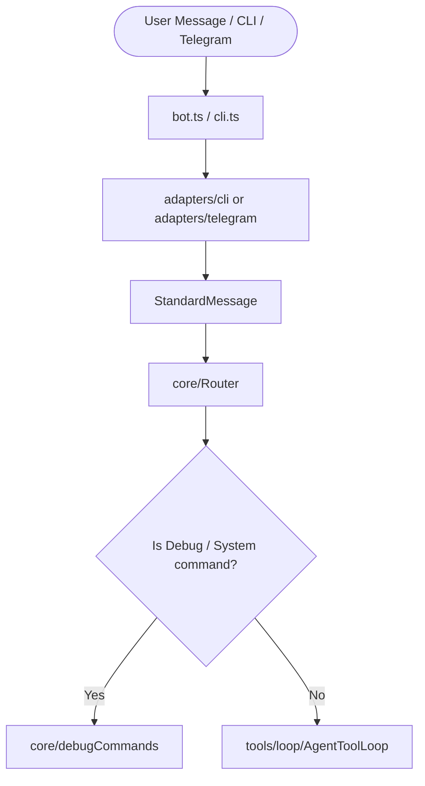

# Architecture

This document defines the system architecture, directory structure, core execution workflows, and security boundaries of the `my-agents` project.

## Core Tech Stack

The agent is built on a modern Node.js and TypeScript runtime:
- **Runtime:** Node.js (with TypeScript for type safety).
- **Communication Interfaces:** Telegram Bot API (via long polling) and a Local CLI for offline testing and automation.
- **Storage Layer:** SQLite (via standard queries/repositories) for session histories, confirmation tokens, and cron schedules.
- **Agentic Capabilities:**
  - **Browser Automation:** Playwright and Chrome DevTools Protocol (CDP) for headless/headed web interaction.
  - **Desktop GUI Control:** X11-based automation using `xdotool` and screenshot utilities.
  - **AI Provider Integration:** Support for Google Gemini (using system instructions and structured schemas) and OpenAI APIs.

---

## Directory Structure

Below is the workspace structure of the project, including the agent's internal layers and user-defined custom skills:

```text
my-agents/
├── agent/                         # Main Agent Application (Node.js/TypeScript)
│   ├── data/                      # Local sqlite databases and artifact stores
│   │   ├── artifacts/             # Stored screenshots, session-captured media, etc.
│   │   └── agent.sqlite           # SQLite db for schedules, confirmations, and chat
│   ├── logs/                      # Log directory (untracked)
│   │   ├── agent.log              # Log output from the bot daemon
│   │   └── ai-interactions/       # Raw JSONL logs of LLM requests & responses
│   ├── prompts/                   # Prompts used to initialize the LLM
│   │   ├── system.md              # System prompt/policy instruction
│   │   └── MEMORY.md              # Shared persistent agent memory
│   ├── src/                       # TypeScript Source Files
│   │   ├── adapters/              # Input/Output adapters (CLI, Telegram)
│   │   ├── artifacts/             # Artifact storage manager
│   │   ├── brain/                 # AI complete logic and providers (Gemini, OpenAI)
│   │   ├── browser/               # Playwright & CDP browser services, URL policies
│   │   ├── config/                # Path management and environment settings
│   │   ├── context/               # System instruction hydration and history compaction
│   │   ├── core/                  # Main Message Router and debugger commands
│   │   ├── logging/               # Trace and file logging helpers
│   │   ├── security/              # Permission policies and confirmation stores
│   │   ├── skills/                # Skill registry scanning
│   │   ├── storage/               # SQLite db setup and repository methods
│   │   ├── tools/                 # Built-in LLM tools (file, computer, tool loop)
│   │   ├── types/                 # Standardized TypeScript type contracts
│   │   └── workflows/             # Multi-step stateful workflows
│   ├── commands.json              # Allowlist of CLI commands the agent can run
│   ├── config.json                # Security permission bounds and schedule config
│   └── package.json               # Dependencies and verification scripts
│
├── skills/                        # Custom modular skill plugins (e.g. bemo)
│   └── bemo/                      # Example skill containing SKILL.md and scripts
│
├── tools/                         # External tools capability definitions
├── docs/                          # Architecture, decisions, and feature intake guides
│   ├── ARCHITECTURE.md            # [This File] System architecture and structure
│   ├── FEATURE_INTAKE.md          # Work classification and risk management
│   ├── HARNESS.md                 # Human-Agent collaboration guidelines
│   └── TEST_MATRIX.md             # Verification expectations and testing
└── AGENTS.md                      # Stable agent instruction shim
```

---

## Core Execution Workflows

### 1. Message Routing Pipeline


### 2. AI Tool Loop
The `AgentToolLoop` coordinates the interaction between the LLM and the system:
1. **Hydration:** The agent hydrates prompt context with the system instructions, active workspace permissions, loaded skills (`SKILL.md`), and memory.
2. **Completion:** The agent requests a response from the LLM provider (e.g. Gemini).
3. **Execution:** If the LLM returns tool calls (e.g. read a file, capture screen), `ToolExecutor` is called.
4. **Safety Verification:** The `PermissionPolicy` validates the tool action. If it requires confirmation, execution halts and generates a **Digest-bound Confirmation** token sent back to the user.
5. **Resume:** Upon receiving a matching `/confirm` command, the execution loop resumes from where it stopped.

### 3. Background Scheduler
The background service periodically executes jobs based on cron rules defined in `config.json`:
- At startup, the scheduler seeds configured schedules into the SQLite database.
- A background worker queries due tasks, claims a lease on them, and runs the command.
- If `notifyOnChangeOnly` is enabled, the agent compares the task output to the previous run's output and only notifies the Telegram channel if a change is detected.

---

## Security Boundary Rules (Zero-Trust)

`my-agents` runs with a strict sandbox safety policy implemented in `security/PermissionPolicy`:

### Directory Restrictions
The agent can only perform read/write operations within paths configured in `permissions.allowedReadRoots` and `permissions.allowedWriteRoots`. Any directory outside this boundary is rejected.

### File Whitelist / Blacklist
- **Blocked Segments:** The agent is blocked from accessing directories containing `.git` or `node_modules`.
- **Sensitive Secrets:** Access to potential security keys, credentials, env vars, or certificates is blocked by regex patterns (e.g. `.env`, `id_rsa`, `.pem`, `secrets.*`).

### Command Allowlist
Arbitrary shell execution is disabled. All external actions must be explicitly defined in `commands.json` with a fixed `argv` list. Subprocesses run with only safe environment variables (`PATH`, `HOME`, `TZ`, etc.) to prevent environment-variable secret leakage.

### Interactive Confirmations
Destructive actions (such as file writes or allowlisted script executions with side-effects) generate a unique cryptographic token:
```text
confirm <command_name> <token>
```
If the command, arguments, or file content preview is altered, the token changes, preventing replay or manipulation attacks.
